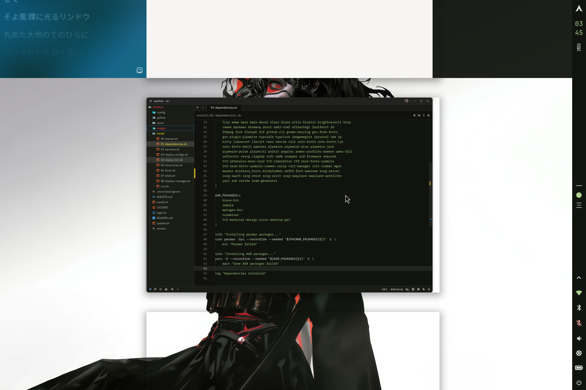
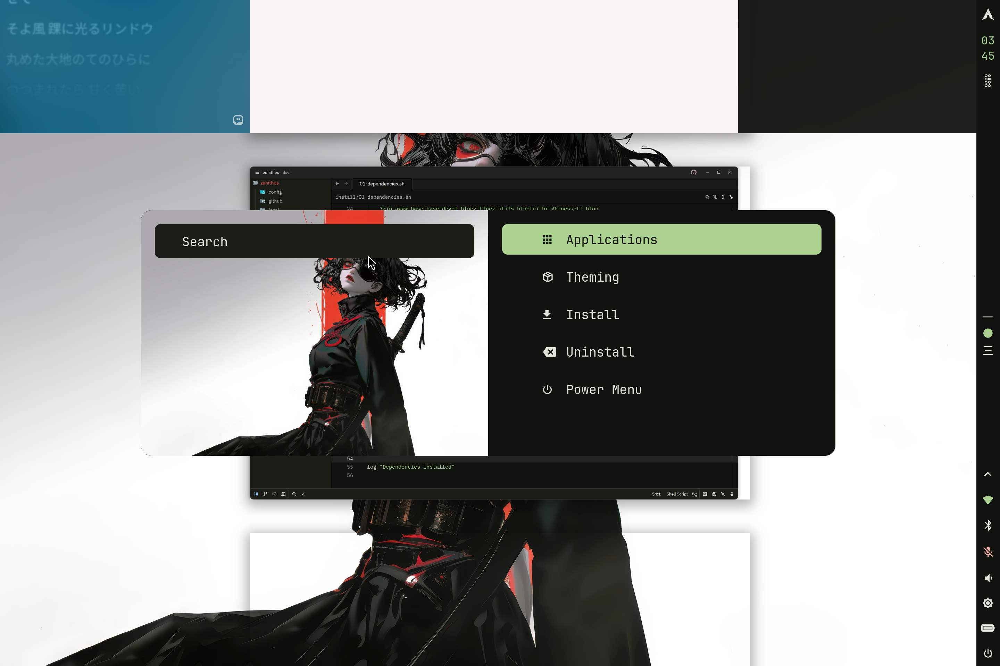
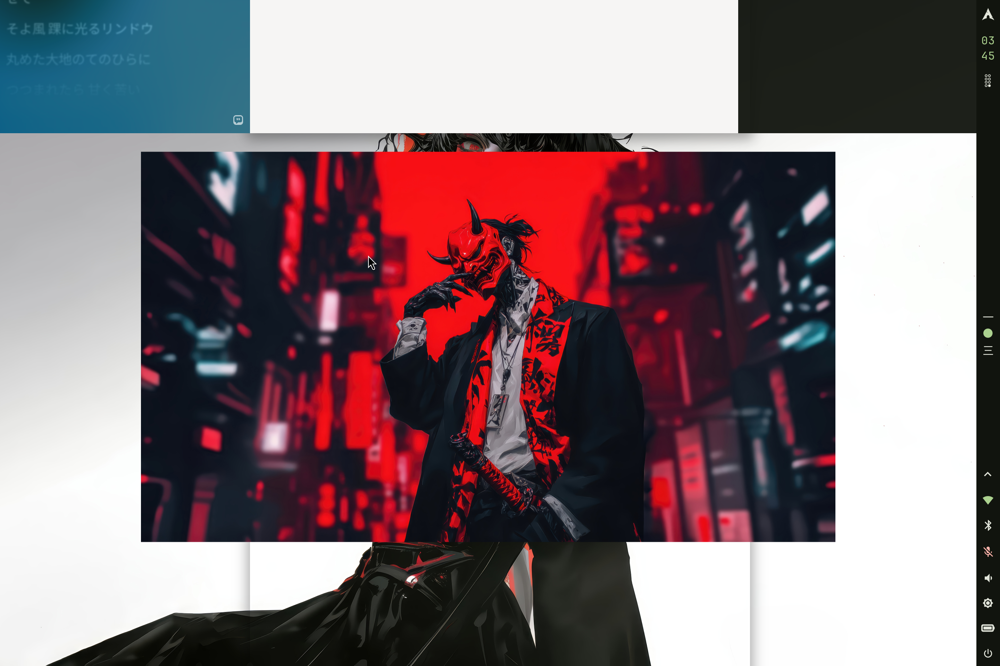
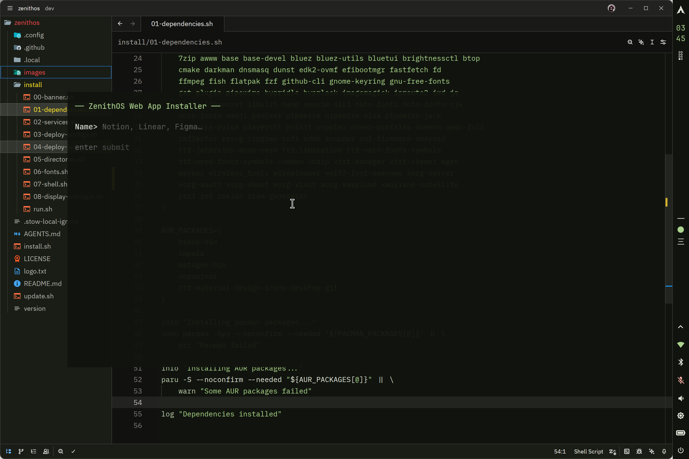
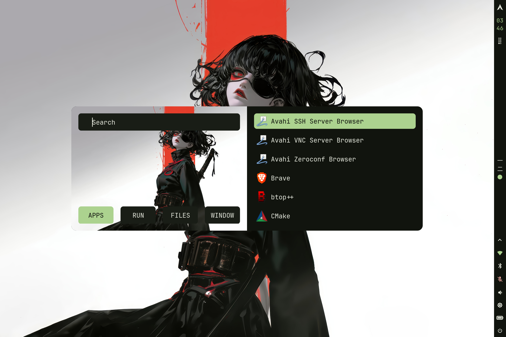
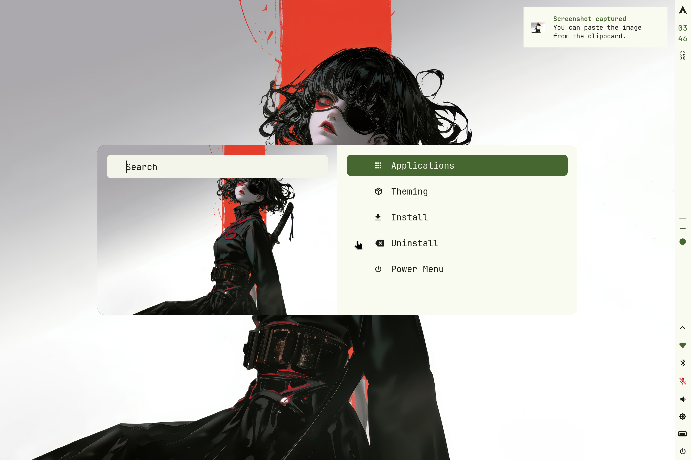

# Zenith-Dotfiles

Complete Arch Linux desktop environment with **Niri** (scrollable-tiling compositor), dynamic **Material You** theming, and ready-to-use configuration.

> **AUR Helper:** [paru](https://github.com/Morganamilo/paru) is the default AUR helper. It is installed automatically if missing.

## Features

- **Niri** — Scrollable-tiling Wayland compositor with preconfigured keybindings
- **Material You** — Dynamic theme auto-generated from your wallpaper using Matugen
- **Dark/Light Mode** — Automatic theme switching with Darkman, integrated with GTK and all apps
- **Waybar** — Vertical status bar with Japanese workspace numerals, CPU snake animation, and drawers
- **SwayOSD** — On-screen display for volume, brightness, and caps-lock using swayosd
- **Hyprlock + Hypridle** — Blurred lock screen and idle management
- **Rofi** — Launcher with wallpaper selector, power menu, theme menu, and web app installer
- **Fish Shell** — Interactive shell with aliases, configured PATH, and dynamic cursor
- **Dunst** — Notifications with Material You colors
- **Kitty** — GPU-accelerated terminal with JetBrainsMono Nerd Font and live theme reload
- **Zed** — Editor with dynamically generated Matugen theme
- **Btop** — System monitor with dynamic theme
- **Yazi** — Terminal file manager with Kitty image preview
- **Fastfetch** — System information display with custom logo
- **Web Apps** — Install/uninstall web apps as standalone desktop entries

## Screenshots

### NiriWM


### Rofi


### Awww


### Web Apps


### App Launcher


### Theme Selector


## Packages installed

### Official repos (pacman)

| Category | Packages |
|----------|----------|
| **Shell** | fish |
| **Compositor** | niri, xwayland-satellite, xorg-xhost |
| **Terminal** | kitty |
| **Bar / Launcher** | waybar, rofi |
| **Notifications** | dunst |
| **OSD** | swayosd |
| **Lock / Idle** | hyprlock, hypridle |
| **System** | btop, htop, fastfetch, snapper |
| **Utilities** | brightnessctl, playerctl, acpi, fzf, unzip, wget, yazi |
| **Audio** | pamixer, ncpamixer |
| **Bluetooth** | bluetui |
| **WiFi** | impala, wireless_tools |
| **Display Manager** | sddm |
| **Fonts** | ttf-jetbrains-mono-nerd, noto-fonts, noto-fonts-cjk, noto-fonts-emoji, woff2-font-awesome |
| **GPU** | xf86-video-amdgpu (adapt to your hardware) |
| **Editors** | neovim, zed, vim, nano |
| **Dev** | git, github-cli, stow, cmake |
| **Power** | power-profiles-daemon, zram-generator |
| **Firmware** | sof-firmware, intel-ucode |
| **Misc** | flatpak, base-devel, darkman |

### AUR (paru)

| Package | Description |
|---------|-------------|
| matugen-bin | Material You color generator |
| awww | Wallpaper manager with animated transitions |
| ttf-material-design-icons-desktop-git | Material Design icons for Waybar |

## Fresh install

```bash
bash <(curl -sSL https://raw.githubusercontent.com/zenith-56/zenith-dotfiles/main/install.sh)
```

The script automatically:
1. Installs dependencies (`gum`, `stow`) if missing
2. Clones Zenith-Dotfiles to `~/zenith-dotfiles`
3. Uses a [Gum](https://github.com/charmbracelet/gum) interface to walk you through:
   - **Install packages** — pacman + AUR (via paru)
   - **Deploy configs** — Copies configs to `~/.config/`
   - **Deploy bin scripts** — Installs `~/.local/bin/` scripts
   - **Directories** — Creates standard user directories
   - **Font cache** — Updates font cache
   - **Shell** — Sets Fish as default
   - **Display Manager** — Optionally enables SDDM

## Update configs

If you already have Zenith-Dotfiles installed and want to pull the latest configs:

```bash
bash <(curl -sSL https://raw.githubusercontent.com/zenith-56/zenith-dotfiles/main/update.sh)
```

Or if you have the repo cloned:

```bash
cd ~/zenith-dotfiles
./update.sh
```

## Zenith Bin Scripts

Modular scripts in `~/.local/bin/` for system control:

| Script | Description |
|--------|-------------|
| `zenith-theme-set {dark\|light}` | Set theme |
| `zenith-theme-get` | Get current theme |
| `zenith-theme-toggle` | Toggle theme |
| `zenith-swayosd-volume {up\|down\|toggle}` | Volume OSD |
| `zenith-swayosd-brightness {up\|down}` | Brightness OSD |
| `zenith-mic` | Toggle microphone mute |
| `zenith-media {play\|pause\|next\|prev\|stop}` | Media controls |
| `zenith-kb-layout {us\|es\|toggle}` | Keyboard layout |
| `zenith-restart-all` | Restart waybar, dunst, swayosd |
| `zenith-restart-waybar` | Restart waybar |
| `zenith-reload-kitty` | Reload kitty colors live |
| `zenith-music-show` | Display current track (for hyprlock) |
| `zenith-webapp-install` | Install web app as desktop entry |
| `zenith-webapp-uninstall` | Remove installed web apps |
| `zenith-restart-swayosd` | Restart swayosd |
| `zenith-lock` | Lock screen |
| `zenith-power-off` | Power off |
| `zenith-reboot` | Reboot |
| `zenith-logout` | Logout |
| `zenith-screenshot` | Screenshot |
| `zenith-screenshot-region` | Region screenshot |
| `zenith-screen-recorder` | Toggle screen recording (select area) |
| `zenith-battery-capacity` | Battery percentage |
| `zenith-battery-status` | Battery status |
| `zenith-brightness-get` | Get brightness |
| `zenith-brightness-set` | Set brightness |
| `zenith-volume-get` | Get volume |
| `zenith-volume-set` | Set volume |
| `zenith-network-status` | Network status |
| `zenith-network-ssid` | Current SSID |

## Project structure

```
zenith-dotfiles/
├── install.sh              # Main installer (delegates to install/)
├── install/                # Modular installation scripts
│   ├── run.sh             # Main runner
│   ├── 00-banner.sh
│   ├── 01-dependencies.sh
│   ├── 02-services.sh
│   ├── 03-deploy-configs.sh
│   ├── 04-deploy-bin.sh
│   ├── 05-directories.sh
│   ├── 06-fonts.sh
│   ├── 07-shell.sh
│   └── 08-display-manager.sh
├── update.sh              # Config updater
├── .local/
│   └── bin/               # Zenith bin scripts
│   └── share/
│       ├── dark-mode.d/   # Dark mode scripts (darkman)
│       └── light-mode.d/  # Light mode scripts (darkman)
├── .config/
│   ├── kitty/            # Terminal
│   ├── btop/             # System monitor
│   ├── dunst/            # Notifications + Matugen template
│   ├── fastfetch/        # System info display
│   ├── fish/             # Shell config
│   ├── hypr/             # hyprlock + hypridle
│   ├── matugen/          # Config + templates
│   │   └── templates/    # Matugen templates
│   ├── niri/             # Compositor config
│   ├── rofi/             # Launcher + scripts
│   ├── swayosd/          # OSD config + template
│   ├── waybar/           # Status bar + scripts
│   │   └── scripts/      # Waybar modules
│   ├── yazi/             # Terminal file manager
│   └── zed/             # Editor
├── .github/
│   └── workflows/        # GitHub Actions
└── images/               # Screenshots
```

## Keybindings (Niri)

| Keys | Action |
|------|--------|
| `Mod+T` | Open terminal (Kitty) |
| `Mod+Space` | App launcher |
| `Mod+Shift+Space` | Main launcher |
| `Mod+Shift+W` | Wallpaper selector |
| `Mod+Shift+T` | Theme menu (dark/light) |
| `Mod+Shift+Delete` | Power menu |
| `Mod+Q` | Close window |
| `Mod+F` | Fullscreen |
| `Mod+V` | Toggle floating/tiled |
| `Mod+1-9` | Switch workspace |
| `Super+L` | Lock screen |
| `XF86AudioRaiseVolume` | Volume up + OSD |
| `XF86AudioLowerVolume` | Volume down + OSD |
| `XF86AudioMute` | Toggle mute |
| `XF86MonBrightnessUp` | Brightness up + OSD |
| `XF86MonBrightnessDown` | Brightness down + OSD |
| `XF86AudioMicMute` | Toggle mic mute |
| `Mod+Shift+K` | Toggle keyboard layout |

## Matugen Integration

Zenith-Dotfiles uses **Matugen** to generate Material You colors from your wallpaper. Templates are provided for:

- Waybar (`colors.css`)
- Rofi (`colors.rasi`)
- Dunst (`dunstrc`)
- Hyprlock (`hyprlock.conf`)
- Kitty (`theme.conf`)
- Zed (`matugen.json`)
- Btop (`matugen.theme`)
- SwayOSD (`style.css`)

When you change wallpaper with `Mod+Shift+W`, Matugen automatically regenerates all colors.

## Wallpapers

Place your wallpapers in `~/Pictures/Wallpapers` and use `Mod+Shift+W` to select one. Matugen will automatically generate colors for all applications.

## Notes

- Keyboard is configured for **Spanish (nodeadkeys)** — edit `niri/input.kdl` to change
- Monitors are set to **eDP-1 (2880x1920@120Hz, scale 2)** and **HDMI-1 (scale 1)** — edit `niri/output.kdl`
- GPU driver is **amdgpu** — change in the `install.sh` package list for your hardware

## Troubleshooting

### Common Issues

| Issue | Solution |
|-------|----------|
| **Waybar not showing** | Run `waybar &` or check config with `jq . ~/.config/waybar/config` |
| **Themes not applying** | Run `matugen image ~/Pictures/Wallpapers/wallpaper.png --prefer value -m dark` |
| **Dark mode not working** | Enable darkman service: `systemctl --user enable --now darkman.service` |
| **Rofi not launching** | Check theme file exists: `ls ~/.config/rofi/themes/` |
| **Kitty colors wrong** | Run `zenith-reload-kitty` or restart kitty |
| **Volume/brightness OSD not showing** | Restart swayosd: `systemctl --user restart swayosd.service` |
| **Wallpaper selector crashes** | Ensure `awww` is installed: `paru -S awww` |
| **Fish shell not starting** | Run `chsh -s $(which fish)` and relogin |
| **Niri config errors** | Validate KDL syntax: check balanced braces `{}` in `~/.config/niri/*.kdl` |
| **Matugen colors not generating** | Check templates exist: `ls ~/.config/matugen/templates/` |

### Manual Config Validation

Before restarting services, validate configs:

```bash
# Waybar JSON
jq empty ~/.config/waybar/config

# Niri KDL (check braces)
for f in ~/.config/niri/*.kdl; do
  echo "$f: $(grep -o '{' "$f" | wc -l) open, $(grep -o '}' "$f" | wc -l) close"
done

# Kitty syntax
kitty @ launch --type=overlay cat ~/.config/kitty/kitty.conf
```

### Service Commands

```bash
# Check service status
systemctl --user status darkman
systemctl --user status swayosd
systemctl status sddm

# Restart services
systemctl --user restart darkman swayosd
pkill waybar && waybar &
pkill dunst && dunst &

# View logs
journalctl --user -u darkman -f
journalctl --user -u swayosd -f
```

### Uninstall

To remove Zenith-Dotfiles:

```bash
cd ~/zenith-dotfiles
./uninstall.sh
```

### Get Help

- Check GitHub Issues: https://github.com/zenith-56/zenith-dotfiles/issues
- Review logs: `journalctl --user -f`
- Test configs in VM before applying to main system

## License

MIT — see [LICENSE](LICENSE)
